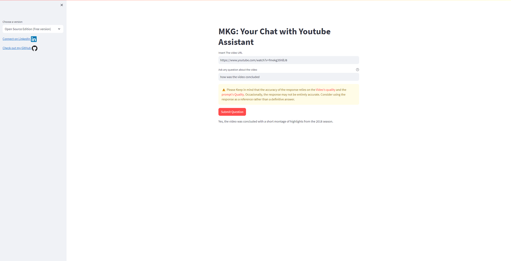
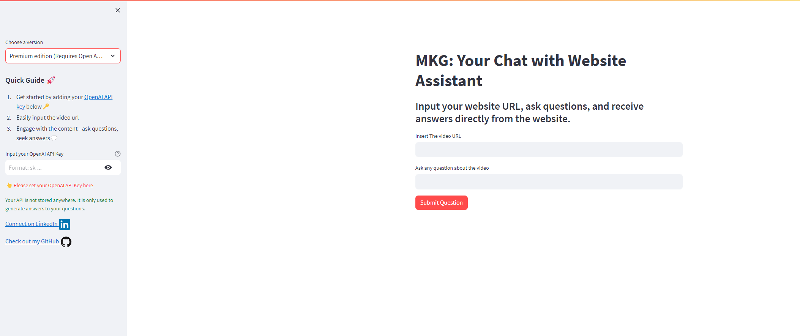

# Chat-with-Youtube





Chat-with-Youtube is a tool designed to facilitate question and answer interactions based on information extracted from Youtube Videos. This chatbot enables you to ask questions about the content of any video and receive relevant answers quickly and efficiently by means of Large Language Models and Generative AI.

## Prerequisites

Before you begin, ensure you have the following installed:

- Python (3.9+ recommended)
- [Git](https://git-scm.com/)
- OpenAI API key(only required in open AI version)

## Installation

1. Clone this repository to your local machine:

   ```bash
   git clone https://github.com/khalil-ghali/chat-with-youtube.git

2. Navigate into the project directory:
    ```bash
    cd chat-with-youtube
    ```
3. Install the necessary dependencies: 
    ```bash
    pip install -r requirements.txt
    ```
4. Run the app:
   ```bash
    streamlit run app.py
    ```
## How to Get Started
  1. Input any Youtube´s URL.
  2. Enter your API key(only required in open AI version).
  3. Ask questions.
  4. Get detailed, AI-generated answers.
